# Attention Visualization Guide

This guide covers all attention visualization and analysis capabilities in mlxterp.

## Overview

mlxterp captures attention weights during model tracing, enabling:

- **Attention heatmaps**: Visualize which tokens attend to which
- **Pattern detection**: Automatically identify head types (induction, previous token, etc.)
- **Multi-head analysis**: Compare patterns across layers and heads
- **Custom analysis**: Build your own attention-based analyses with custom pattern functions
- **Interactive exploration**: CircuitsViz-style interactive visualizations for Jupyter and HTML

## Quick Start

```python
from mlxterp import InterpretableModel
from mlxterp.visualization import (
    get_attention_patterns,
    attention_heatmap,
    attention_from_trace,
    detect_head_types,
    AttentionVisualizationConfig,
)

# Load model
model = InterpretableModel("mlx-community/Llama-3.2-1B-Instruct-4bit")

# Trace to capture attention
with model.trace("The cat sat on the mat") as trace:
    pass

# Get attention patterns
patterns = get_attention_patterns(trace)
tokens = model.to_str_tokens("The cat sat on the mat")

# Create visualization
config = AttentionVisualizationConfig(colorscale="Blues", mask_upper_tri=True)
fig = attention_heatmap(patterns[5], tokens, head_idx=0, config=config)
```

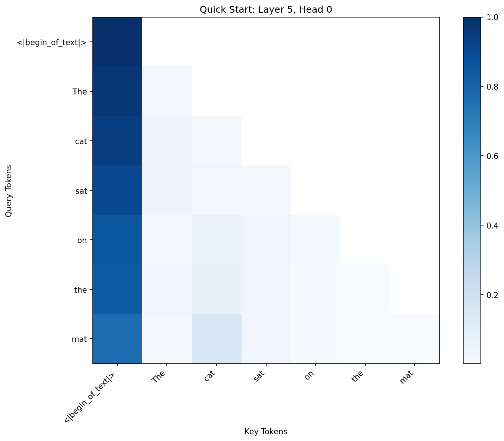

*Figure 1: Basic attention heatmap showing Layer 5, Head 0 attention pattern. The y-axis shows query positions (source tokens), while the x-axis shows key positions (target tokens). Darker blue indicates higher attention weights.*

## Extracting Attention Patterns

### Basic Extraction

```python
from mlxterp.visualization import get_attention_patterns

with model.trace(text) as trace:
    pass

# Get all layers
patterns = get_attention_patterns(trace)
print(f"Captured {len(patterns)} layers")

# Get specific layers
patterns = get_attention_patterns(trace, layers=[0, 5, 10])
```

### Understanding Pattern Shapes

```python
# patterns[layer_idx] has shape: (batch, heads, seq_q, seq_k)
pattern = patterns[0]
print(f"Shape: {pattern.shape}")
# (1, 32, 6, 6) for batch=1, 32 heads, 6 tokens

# Access specific head
head_0 = pattern[0, 0]  # First batch, first head
# Shape: (seq_q, seq_k) = (6, 6)
```

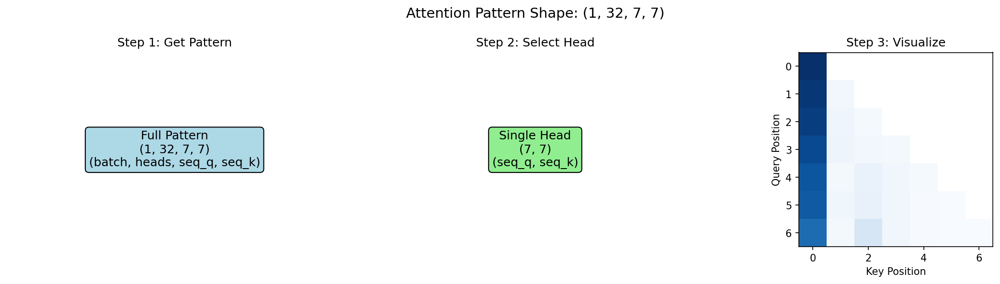

*Figure 2: Understanding attention tensor dimensions. The 4D tensor (batch, heads, seq_q, seq_k) allows access to individual attention heads for analysis.*

### Token Strings

Use `to_str_tokens` to get readable token labels:

```python
tokens = model.to_str_tokens("Hello world")
print(tokens)  # ['<|begin_of_text|>', 'Hello', ' world']

# Also works with token IDs
token_ids = model.encode("Hello world")
tokens = model.to_str_tokens(token_ids)
```

## Visualization Functions

### Single Heatmap

```python
from mlxterp.visualization import attention_heatmap, AttentionVisualizationConfig

config = AttentionVisualizationConfig(
    colorscale="Blues",    # Matplotlib colormap name
    mask_upper_tri=True,   # Mask future positions (causal)
    figsize=(8, 6)
)

fig = attention_heatmap(
    patterns[5],          # Attention from layer 5
    tokens,               # Token labels
    head_idx=0,           # Which head to show
    title="Layer 5, Head 0",
    backend="matplotlib", # or "plotly", "circuitsviz"
    config=config
)
```

### Colorscale Options

Different colorscales highlight different attention patterns:

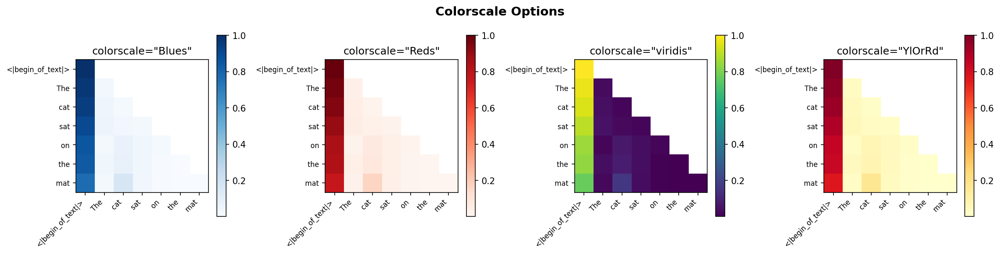

*Figure 3: Comparison of colorscale options. Choose based on your visualization needs: Blues for standard analysis, Reds for emphasis, viridis for perceptually uniform gradients, YlOrRd for heatmap-style displays.*

### Grid of Multiple Heads

```python
from mlxterp.visualization import attention_from_trace, AttentionVisualizationConfig

config = AttentionVisualizationConfig(
    backend="matplotlib",
    colorscale="Blues",
    mask_upper_tri=True
)

fig = attention_from_trace(
    trace,
    tokens,
    layers=[0, 4, 8, 12],  # 4 layers
    heads=[0, 1, 2, 3],     # 4 heads per layer
    mode="grid",            # Grid layout
    head_notation="LH",     # "L5H3" style titles
    config=config
)
```

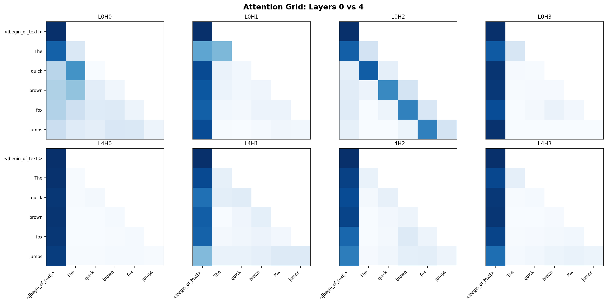

*Figure 4: Grid visualization comparing attention patterns across layers (rows) and heads (columns). Notice how Layer 0 heads show more diffuse patterns, while Layer 4 heads show more specialized attention.*

### Visualization Backends

mlxterp supports multiple backends:

| Backend | Best For | Installation |
|---------|----------|--------------|
| `matplotlib` | Publication figures, local use | Included |
| `plotly` | Interactive exploration | `pip install plotly` |
| `circuitsviz` | Jupyter notebooks, web | `pip install circuitsviz` |

```python
# Auto-detect best available
config = AttentionVisualizationConfig(backend="auto")

# Force specific backend
config = AttentionVisualizationConfig(backend="plotly")
```

## Interactive Visualization

mlxterp includes a custom-built interactive visualization system inspired by CircuitsViz, with no external dependencies. This provides a rich exploration experience for attention patterns.

### Live Demo

Try the interactive visualization below (hover over tokens to see attention connections):

<iframe src="../assets/interactive_attention_demo.html" width="100%" height="800" frameborder="0" style="border: 1px solid #ddd; border-radius: 8px;"></iframe>

### Features

The interactive visualization includes:

- **Token bar with hover highlighting**: Hover over any token to instantly see attention connections - no click required! Click to lock the selection.
- **Head selector grid**: Thumbnail previews of all heads - hover to preview, click to lock
- **Main attention heatmap**: Full-size view of the selected head's attention pattern
- **Source ↔ Destination toggle**: Switch between "what does this token attend to" and "what attends to this token"
- **Layer slider**: Navigate between layers
- **Cross-layer attention flow**: When hovering over a token, see how its attention evolves across all layers

### Quick Start - Interactive

```python
from mlxterp import InterpretableModel
from mlxterp.visualization import (
    get_attention_patterns,
    interactive_attention,
    display_interactive_attention,
    save_interactive_attention,
    InteractiveAttentionConfig,
)

# Load model and trace
model = InterpretableModel("mlx-community/Llama-3.2-1B-Instruct-4bit")

text = "Her name was Alex Hart. Tomorrow at lunch time Alex"
with model.trace(text) as trace:
    pass

tokens = model.to_str_tokens(text)
patterns = get_attention_patterns(trace)

# Option 1: Display in Jupyter notebook
display_interactive_attention(patterns, tokens)

# Option 2: Save as standalone HTML file
save_interactive_attention(patterns, tokens, "attention_explorer.html")

# Option 3: Get HTML string for custom use
html = interactive_attention(patterns, tokens)
```

### Configuration

```python
config = InteractiveAttentionConfig(
    title="My Attention Analysis",  # Title shown at top
    heatmap_size=400,               # Size of main heatmap in pixels
)

save_interactive_attention(patterns, tokens, "output.html", config=config)
```

### Using the Interactive Interface

1. **Explore heads**: Hover over thumbnails in the head selector to preview different heads. Click to lock a head for detailed analysis.

2. **Highlight a token**: Simply hover over any token in the token bar to instantly see:
   - Its attention pattern highlighted in the heatmap
   - Attention weights on other tokens (color intensity = attention strength)
   - Cross-layer attention flow showing how this token's attention evolves

3. **Lock a token**: Click any token to lock the selection - it will stay highlighted even when you move the mouse away. Click again to unlock. The info panel shows `[LOCKED]` when a token is locked.

4. **Toggle direction**: Use the "Source → Dest" / "Source ← Dest" buttons to switch between:
   - **Source → Dest**: What does the selected token attend to?
   - **Source ← Dest**: What tokens attend to the selected token?

5. **Navigate layers**: Use the layer slider to see how attention patterns change across layers. Click on any layer in the cross-layer flow to jump to it.

6. **Hover for details**: Hover over the heatmap to see exact attention percentages between token pairs.

### Direct from Trace

For convenience, you can create the visualization directly from a trace:

```python
from mlxterp.visualization import interactive_attention_from_trace

with model.trace(text) as trace:
    pass

html = interactive_attention_from_trace(
    trace,
    tokens,
    layers=[0, 5, 10, 15],  # Optional: select specific layers
)
```

### Embedding in Documentation

The generated HTML is self-contained and can be:
- Opened directly in any browser
- Embedded in Jupyter notebooks
- Included in web-based documentation
- Shared as standalone files

## Pattern Detection

### Built-in Head Types

mlxterp includes detectors for common attention head types discovered in mechanistic interpretability research:

| Type | Description | Score Function | Typical Location |
|------|-------------|----------------|------------------|
| `previous_token` | Attends to position i-1 | `previous_token_score()` | Early layers |
| `first_token` | Attends to position 0 (BOS) | `first_token_score()` | All layers |
| `current_token` | Attends to self (diagonal) | `current_token_score()` | Various |
| `induction` | Pattern completion (A B ... A → B) | `induction_score()` | Middle-late layers |

### Detecting Head Types

```python
from mlxterp.visualization import detect_head_types

head_types = detect_head_types(
    model,
    "The quick brown fox jumps over the lazy dog",
    threshold=0.3,
    layers=[0, 5, 10, 15]  # Optional: specific layers
)

print("Head Types Found:")
for head_type, heads in head_types.items():
    if heads:
        print(f"  {head_type}: {len(heads)} heads")
        for layer, head in heads[:3]:
            print(f"    L{layer}H{head}")
```

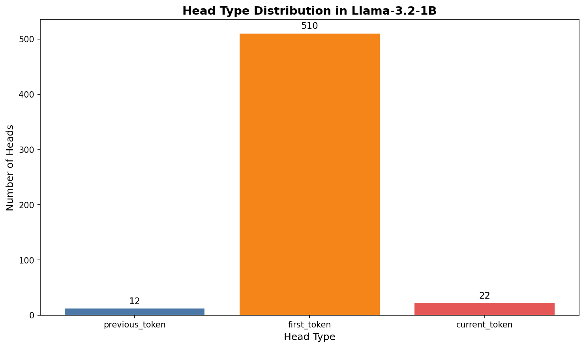

*Figure 5: Distribution of detected head types in Llama-3.2-1B. First token (BOS) heads dominate, which is typical for LLMs using BOS token as a "no-op" attention sink.*

### Previous Token Heads

Previous token heads form the foundation for induction. They appear primarily in early layers:

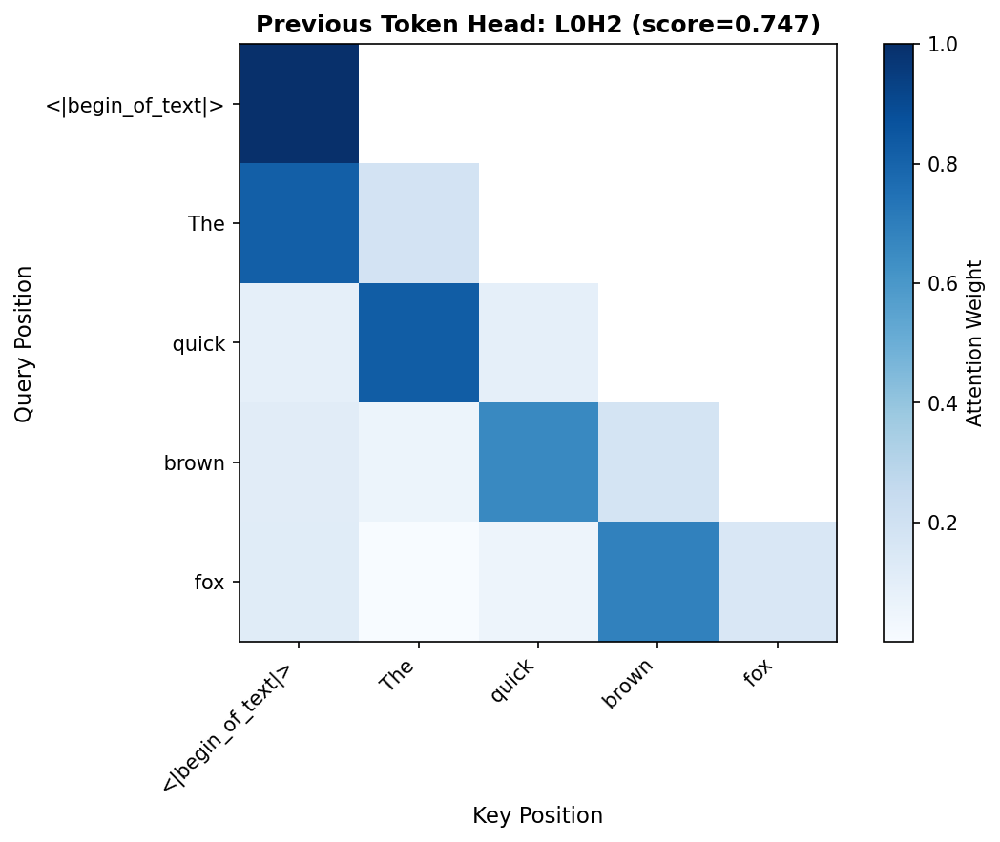

*Figure 6: Example previous token head (L0H2, score=0.75). The strong sub-diagonal pattern shows each position primarily attending to the immediately preceding token.*

### First Token (BOS) Heads

First token heads attend strongly to position 0 (beginning of sequence):

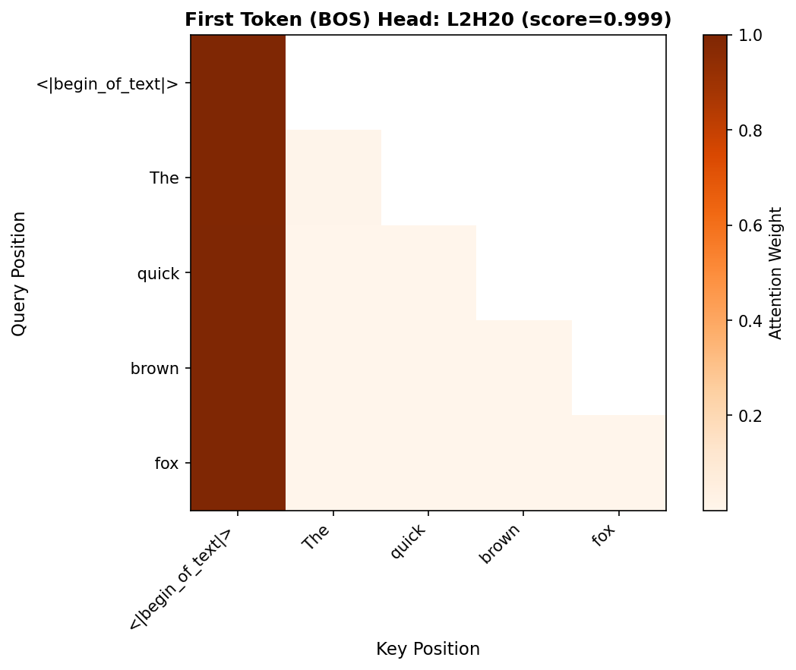

*Figure 7: First token head (L2H20, score=0.999). The first column dominates, showing nearly all positions attend strongly to the BOS token. This acts as an attention "sink" for tokens that don't need to attend elsewhere.*

### Detecting Induction Heads

For accurate induction head detection, use repeated random sequences:

```python
from mlxterp.visualization import detect_induction_heads

induction_heads = detect_induction_heads(
    model,
    n_random_tokens=50,  # Length of random sequence
    n_repeats=2,         # Repeat twice
    threshold=0.3,       # Score threshold
    seed=42              # Reproducibility
)

print(f"Found {len(induction_heads)} induction heads")
for head in induction_heads[:5]:
    print(f"  L{head.layer}H{head.head}: {head.score:.3f}")
```

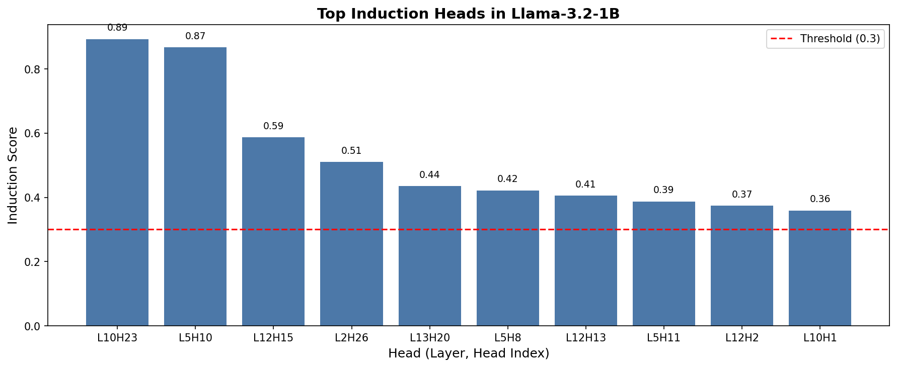

*Figure 8: Top induction heads in Llama-3.2-1B detected using repeated random tokens. Heads above the threshold (red line) show strong induction behavior.*

### Computing Pattern Scores

```python
from mlxterp.visualization import (
    induction_score,
    previous_token_score,
    first_token_score,
)
import numpy as np

# Get a single head's pattern
head_pattern = patterns[5][0, 3]  # Layer 5, batch 0, head 3

# Compute scores
prev_score = previous_token_score(head_pattern)
first_score = first_token_score(head_pattern)
print(f"Previous token: {prev_score:.3f}")
print(f"First token: {first_score:.3f}")

# Induction score requires sequence length
ind_score = induction_score(head_pattern, seq_len=5)
print(f"Induction: {ind_score:.3f}")
```

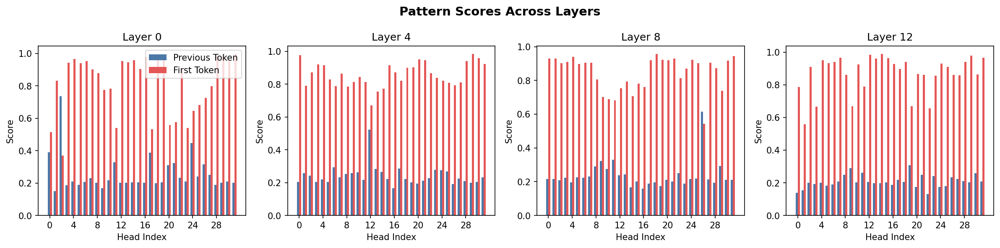

*Figure 9: Pattern scores across layers. Blue bars show previous token scores, red bars show first token scores. Early layers (0) have more heads with high first-token scores, while the pattern varies in later layers.*

### Using AttentionPatternDetector

For custom analysis with configurable thresholds:

```python
from mlxterp.visualization import AttentionPatternDetector

detector = AttentionPatternDetector(
    induction_threshold=0.4,
    previous_token_threshold=0.5,
    first_token_threshold=0.3,
    current_token_threshold=0.3
)

# Analyze a head
scores = detector.analyze_head(head_pattern)
print(f"All scores: {scores}")

# Classify
types = detector.classify_head(head_pattern)
print(f"Classification: {types}")
```

## Custom Pattern Detection

The pattern detection system is fully extensible. You can define custom patterns to detect any attention behavior you observe in your analysis.

### Understanding the Pattern Detection Architecture

Pattern detection in mlxterp follows a simple functional design:

1. **Pattern Scoring Function**: A function that takes an attention matrix `(seq_q, seq_k)` and returns a score (0-1)
2. **Threshold**: A cutoff value to classify heads as exhibiting the pattern
3. **Search**: Iterate over heads and filter by threshold

### Creating Custom Pattern Scores

Define any pattern by writing a scoring function:

```python
import numpy as np

def diagonal_score(pattern):
    """Score for attention to self (main diagonal).

    High scores indicate the head attends primarily to the current position.
    """
    pattern = np.array(pattern)
    return float(np.mean(np.diag(pattern)))

def anti_diagonal_score(pattern):
    """Score for attention to positions in reverse order.

    Detects heads that attend to the end of the sequence from the beginning.
    """
    pattern = np.array(pattern)
    return float(np.mean(np.diag(np.fliplr(pattern))))

def local_window_score(pattern, window_size=3):
    """Score for attention within a local window.

    Detects heads that focus on nearby tokens (local attention pattern).
    """
    pattern = np.array(pattern)
    n = pattern.shape[0]
    score = 0.0
    count = 0
    for i in range(n):
        for j in range(max(0, i - window_size), min(n, i + 1)):
            score += pattern[i, j]
            count += 1
    return score / count if count > 0 else 0.0

def sparse_attention_score(pattern, sparsity_threshold=0.1):
    """Score for sparse attention patterns.

    High scores indicate the head concentrates attention on few positions.
    """
    pattern = np.array(pattern)
    # Count positions with attention > threshold
    sparse_count = np.sum(pattern > sparsity_threshold, axis=1)
    # Lower count = more sparse = higher score
    max_positions = pattern.shape[1]
    sparsity = 1.0 - (np.mean(sparse_count) / max_positions)
    return float(sparsity)
```

### Using Custom Patterns with find_attention_pattern

```python
from mlxterp.visualization.patterns import find_attention_pattern

# Find all heads matching your custom pattern
diagonal_heads = find_attention_pattern(
    model,
    "The quick brown fox jumps over the lazy dog",
    pattern_fn=diagonal_score,
    threshold=0.3
)

print(f"Found {len(diagonal_heads)} diagonal attention heads")
for layer, head, score in diagonal_heads[:5]:
    print(f"  L{layer}H{head}: {score:.3f}")
```

### Creating Composite Patterns

Combine multiple pattern scores for complex detection:

```python
def induction_plus_previous_score(pattern, seq_len=None):
    """Detect heads that are both induction AND previous-token heads.

    This combination is characteristic of the two-step induction mechanism.
    """
    from mlxterp.visualization import induction_score, previous_token_score

    ind_score = induction_score(pattern, seq_len=seq_len)
    prev_score = previous_token_score(pattern)

    # Both must be present - use geometric mean
    return float(np.sqrt(ind_score * prev_score))

def content_vs_position_score(pattern):
    """Classify whether head uses content-based or position-based attention.

    Returns score > 0.5 for content-based, < 0.5 for position-based.
    Useful for understanding attention mechanisms.
    """
    pattern = np.array(pattern)

    # Position-based: similar patterns across rows
    row_variance = np.var(pattern, axis=0).mean()

    # Content-based: different patterns across rows
    col_variance = np.var(pattern, axis=1).mean()

    # Normalize
    total = row_variance + col_variance
    if total < 1e-6:
        return 0.5

    return float(col_variance / total)
```

### Building a Custom Pattern Detector Class

For reusable pattern detection, create a custom detector:

```python
from dataclasses import dataclass
from typing import List, Tuple, Callable, Dict
import numpy as np

@dataclass
class PatternMatch:
    """Result of pattern detection."""
    layer: int
    head: int
    score: float
    pattern_name: str

class CustomPatternDetector:
    """Extensible pattern detector for attention analysis.

    Add your own patterns and detect them across model heads.
    """

    def __init__(self):
        self.patterns: Dict[str, Tuple[Callable, float]] = {}

    def register_pattern(self, name: str, score_fn: Callable, threshold: float = 0.3):
        """Register a new pattern for detection.

        Args:
            name: Human-readable pattern name
            score_fn: Function (attention_matrix) -> float score in [0, 1]
            threshold: Minimum score to classify as this pattern
        """
        self.patterns[name] = (score_fn, threshold)

    def detect_all(self, model, text: str, layers: List[int] = None) -> Dict[str, List[PatternMatch]]:
        """Detect all registered patterns across model heads.

        Returns:
            Dict mapping pattern names to lists of matching heads
        """
        from mlxterp.visualization import get_attention_patterns

        with model.trace(text) as trace:
            pass

        patterns = get_attention_patterns(trace, layers=layers)

        results = {name: [] for name in self.patterns}

        for layer_idx, layer_attn in patterns.items():
            n_heads = layer_attn.shape[1]
            for head_idx in range(n_heads):
                head_pattern = np.array(layer_attn[0, head_idx])

                for pattern_name, (score_fn, threshold) in self.patterns.items():
                    score = score_fn(head_pattern)
                    if score >= threshold:
                        results[pattern_name].append(
                            PatternMatch(layer_idx, head_idx, score, pattern_name)
                        )

        # Sort by score descending
        for name in results:
            results[name].sort(key=lambda x: x.score, reverse=True)

        return results

# Usage example
detector = CustomPatternDetector()

# Register built-in patterns
from mlxterp.visualization import previous_token_score, first_token_score
detector.register_pattern("previous_token", previous_token_score, threshold=0.5)
detector.register_pattern("first_token", first_token_score, threshold=0.3)

# Register custom patterns
detector.register_pattern("diagonal", diagonal_score, threshold=0.3)
detector.register_pattern("local_window", local_window_score, threshold=0.4)
detector.register_pattern("sparse", sparse_attention_score, threshold=0.7)

# Detect all patterns
results = detector.detect_all(model, "The quick brown fox jumps over the lazy dog")

for pattern_name, matches in results.items():
    if matches:
        print(f"\n{pattern_name}: {len(matches)} heads")
        for match in matches[:3]:
            print(f"  L{match.layer}H{match.head}: {match.score:.3f}")
```

### Visualizing Custom Patterns

Create visualizations for your detected patterns:

```python
def visualize_pattern_distribution(detector_results, model_name="Model"):
    """Visualize the distribution of custom patterns across a model."""
    import matplotlib.pyplot as plt

    pattern_counts = {name: len(matches) for name, matches in detector_results.items()}

    fig, ax = plt.subplots(figsize=(10, 6))
    bars = ax.bar(pattern_counts.keys(), pattern_counts.values())
    ax.set_ylabel("Number of Heads")
    ax.set_xlabel("Pattern Type")
    ax.set_title(f"Custom Pattern Distribution in {model_name}")

    for bar, count in zip(bars, pattern_counts.values()):
        ax.text(bar.get_x() + bar.get_width()/2, bar.get_height() + 0.5,
                str(count), ha='center', va='bottom')

    plt.tight_layout()
    return fig

def plot_pattern_by_layer(detector_results, pattern_name, n_layers=16):
    """Show where a specific pattern appears across layers."""
    import matplotlib.pyplot as plt
    import numpy as np

    matches = detector_results.get(pattern_name, [])

    layer_counts = np.zeros(n_layers)
    layer_max_scores = np.zeros(n_layers)

    for match in matches:
        layer_counts[match.layer] += 1
        layer_max_scores[match.layer] = max(layer_max_scores[match.layer], match.score)

    fig, (ax1, ax2) = plt.subplots(1, 2, figsize=(14, 5))

    # Count by layer
    ax1.bar(range(n_layers), layer_counts)
    ax1.set_xlabel("Layer")
    ax1.set_ylabel("Number of Heads")
    ax1.set_title(f"{pattern_name} - Count by Layer")

    # Max score by layer
    ax2.bar(range(n_layers), layer_max_scores, color='orange')
    ax2.set_xlabel("Layer")
    ax2.set_ylabel("Max Score")
    ax2.set_title(f"{pattern_name} - Max Score by Layer")

    plt.tight_layout()
    return fig
```

### Pattern Detection Best Practices

1. **Normalize scores to [0, 1]**: Makes threshold selection consistent
2. **Test on diverse inputs**: Patterns may vary by input type
3. **Validate with ablation**: Confirm detected heads are causally important
4. **Document your patterns**: Future you will thank you

## Advanced Usage

### Analyzing Specific Token Relationships

```python
# Which tokens does position 5 attend to?
attn_from_pos_5 = head_pattern[5, :]
print(f"Position 5 attends to: {np.argsort(attn_from_pos_5)[::-1][:3]}")

# What attends to position 2?
attn_to_pos_2 = head_pattern[:, 2]
print(f"Positions attending to 2: {np.where(attn_to_pos_2 > 0.1)[0]}")
```

### Comparing Across Prompts

```python
def compare_attention(model, prompts, layer, head):
    """Compare attention patterns across different prompts."""
    import matplotlib.pyplot as plt

    fig, axes = plt.subplots(1, len(prompts), figsize=(5*len(prompts), 4))

    for idx, prompt in enumerate(prompts):
        with model.trace(prompt) as trace:
            pass

        patterns = get_attention_patterns(trace, layers=[layer])
        tokens = model.to_str_tokens(prompt)

        attn = patterns[layer][0, head]
        mask = np.triu(np.ones_like(attn), k=1)
        attn_masked = np.where(mask, np.nan, attn)

        ax = axes[idx]
        ax.imshow(attn_masked, cmap='Blues')
        ax.set_xticks(range(len(tokens)))
        ax.set_xticklabels(tokens, rotation=45, ha='right', fontsize=8)
        ax.set_yticks(range(len(tokens)))
        ax.set_yticklabels(tokens, fontsize=8)
        ax.set_title(f'"{prompt[:20]}..."')

    plt.tight_layout()
    return fig

# Compare attention across prompts
fig = compare_attention(
    model,
    ["The cat sat", "A dog ran", "My car drove"],
    layer=5,
    head=0
)
```

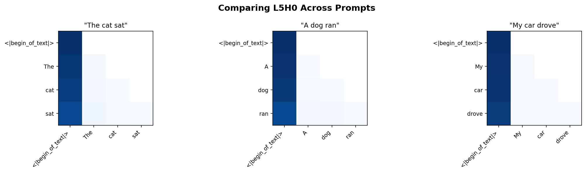

*Figure 10: Comparing the same head (L5H0) across different prompts. This reveals whether attention patterns are content-dependent or primarily structural.*

### Aggregating Across Heads

```python
def layer_attention_summary(patterns, layer_idx):
    """Summarize attention across all heads in a layer."""
    attn = patterns[layer_idx]  # (batch, heads, seq_q, seq_k)

    # Mean across heads
    mean_attn = np.mean(attn[0], axis=0)

    # Max across heads
    max_attn = np.max(attn[0], axis=0)

    return mean_attn, max_attn

mean_attn, max_attn = layer_attention_summary(patterns, 5)
```

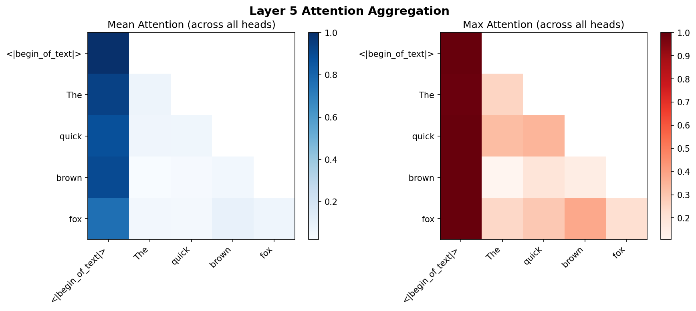

*Figure 11: Aggregated attention in Layer 5. Left: Mean attention across all 32 heads shows the average behavior. Right: Max attention shows where any head strongly attends, highlighting important token relationships.*

## Best Practices

### 1. Use Random Tokens for Induction Detection

```python
# Good: Random tokens eliminate semantic confounds
induction_heads = detect_induction_heads(model, n_random_tokens=50)

# Less reliable: Natural text has many patterns
head_types = detect_head_types(model, "natural text")
```

### 2. Check Multiple Layers

```python
# Analyze pattern evolution through layers
for layer in [0, 4, 8, 12, 15]:
    types = detect_head_types(model, text, layers=[layer])
    print(f"Layer {layer}: {sum(len(v) for v in types.values())} classified heads")
```

### 3. Use Appropriate Thresholds

```python
# Start conservative, then relax
for threshold in [0.5, 0.4, 0.3, 0.2]:
    heads = detect_induction_heads(model, threshold=threshold)
    print(f"Threshold {threshold}: {len(heads)} heads")
```

### 4. Validate with Ablation

```python
from mlxterp import interventions as iv

# Confirm head importance by ablating it
text = "The cat sat on the mat. The cat"

# Normal
with model.trace(text) as trace:
    normal_out = model.output.save()

# Ablated
with model.trace(text, interventions={"model.model.layers.8.self_attn": iv.zero_out}):
    ablated_out = model.output.save()

# Compare predictions
normal_pred = model.get_token_predictions(normal_out[0, -1, :], top_k=1)[0]
ablated_pred = model.get_token_predictions(ablated_out[0, -1, :], top_k=1)[0]

print(f"Normal: {model.token_to_str(normal_pred)}")
print(f"Ablated: {model.token_to_str(ablated_pred)}")
```

## Common Issues

### Memory with Long Sequences

For long sequences, attention patterns can be large:

```python
# Shape: (batch, heads, seq_len, seq_len)
# For 32 heads and 1024 tokens: 32 * 1024 * 1024 * 4 bytes = 128MB per layer

# Process specific layers only
patterns = get_attention_patterns(trace, layers=[5, 10])
```

### Causal Masking

Upper triangular entries are masked (future positions):

```python
# Always use mask_upper_tri=True for causal models
config = AttentionVisualizationConfig(mask_upper_tri=True)
```

### Tokenization Alignment

Ensure tokens match the traced sequence:

```python
text = "Hello world"
with model.trace(text) as trace:
    pass

# Use same text for tokenization
tokens = model.to_str_tokens(text)  # Correct
# NOT: tokens = model.to_str_tokens("different text")
```

## See Also

- [Tutorial 5: Induction Heads](../tutorials/05_induction_heads.md) - Comprehensive induction head analysis
- [API Reference: Visualization Module](../API.md#visualization-module) - Complete API documentation
- [Activation Patching Guide](activation_patching.md) - Causal intervention techniques
