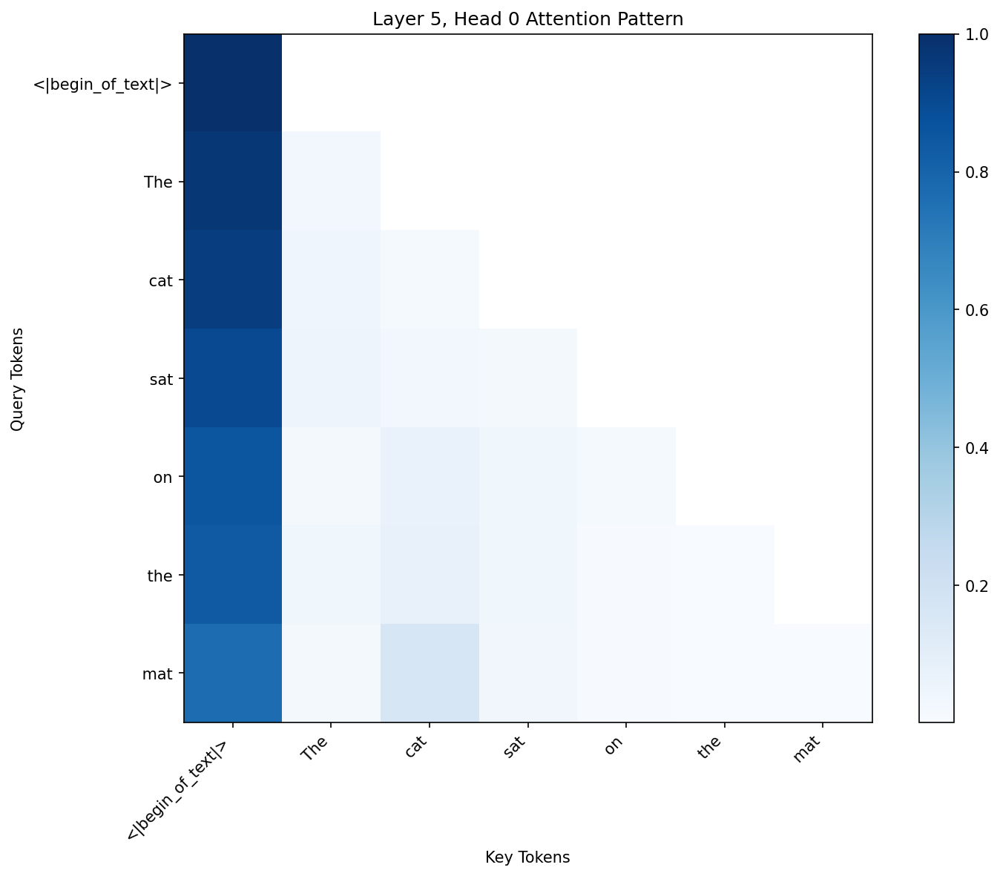
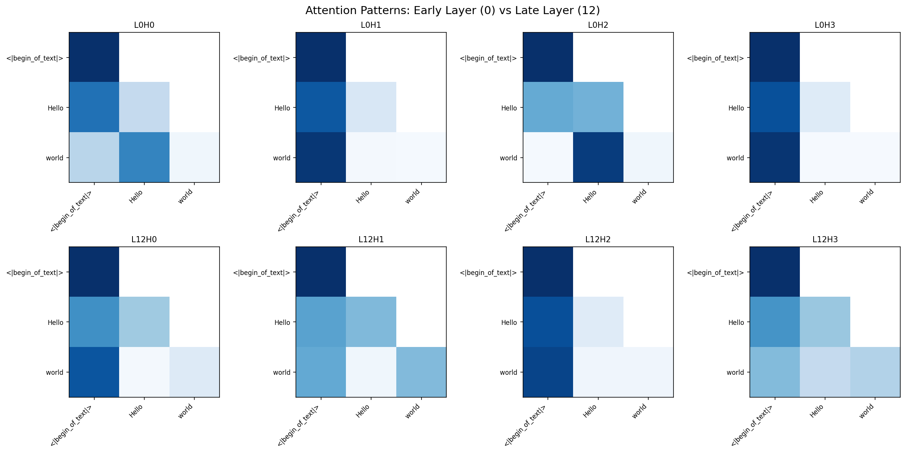
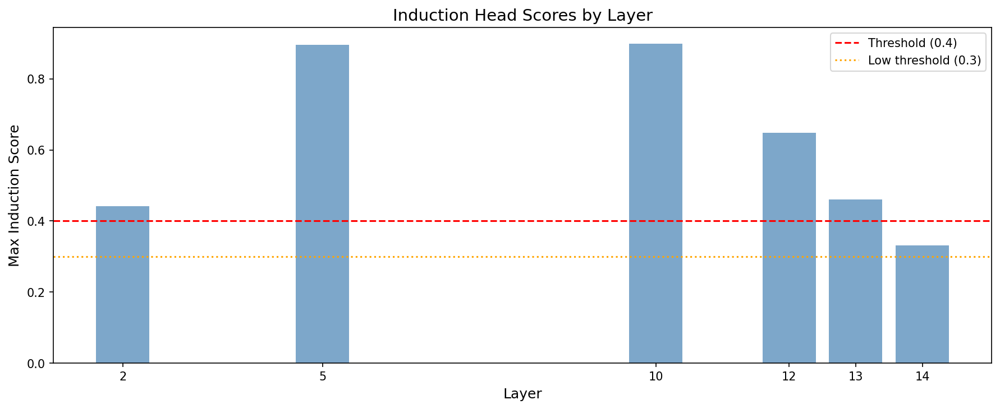
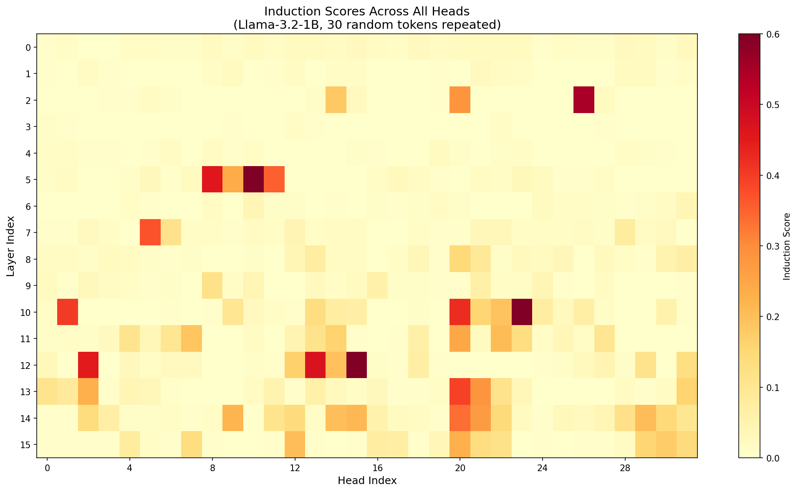
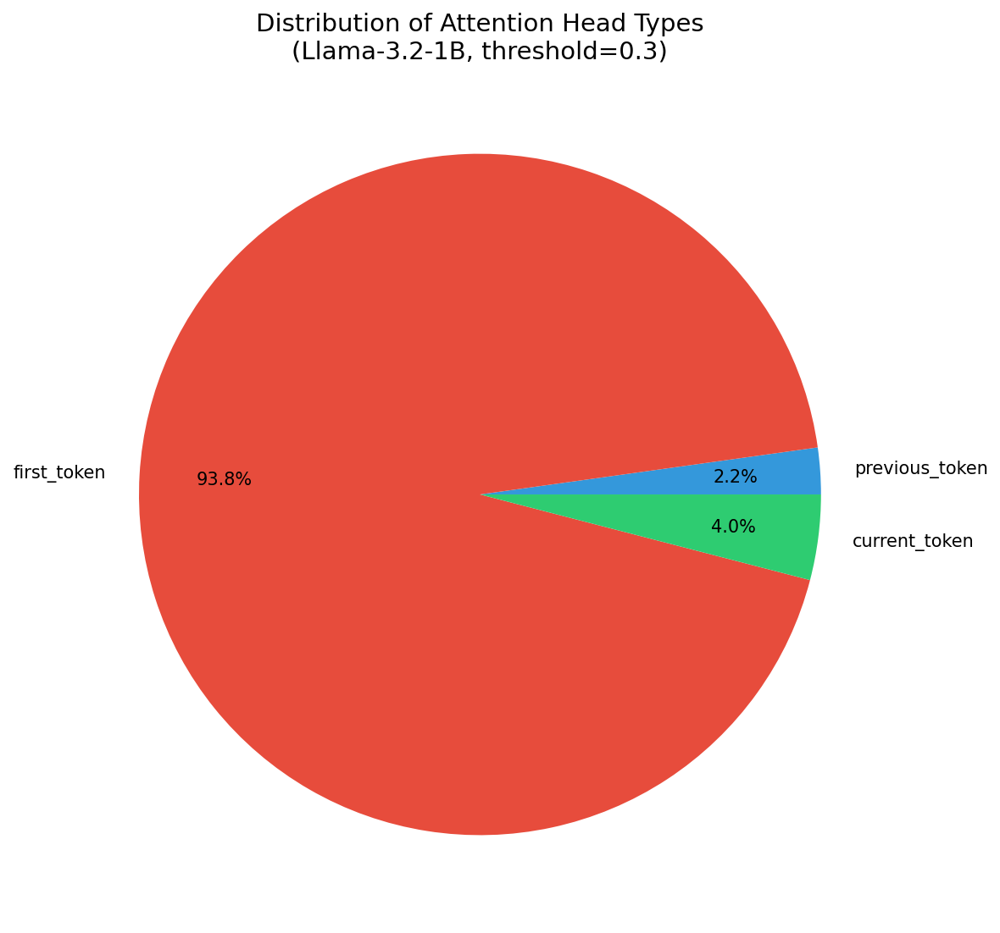
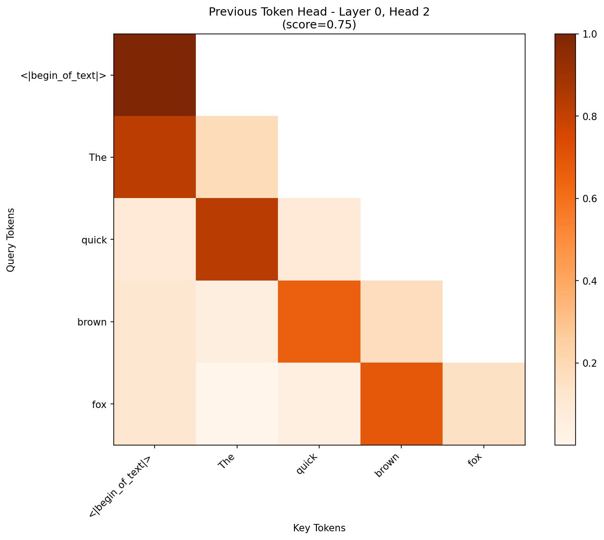
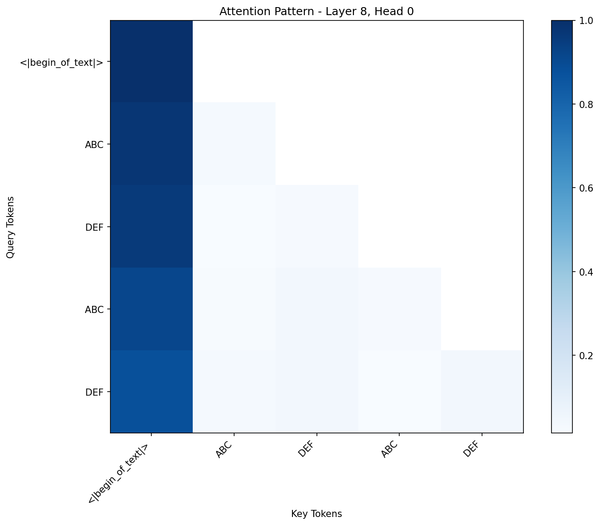
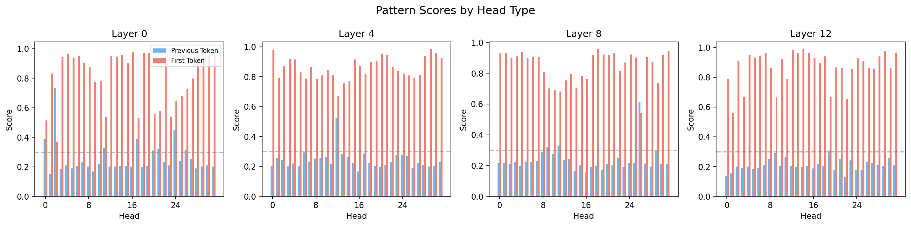

# Tutorial 5: Induction Heads

**Paper**: [In-context Learning and Induction Heads](https://transformer-circuits.pub/2022/in-context-learning-and-induction-heads/) by Olsson et al. (Anthropic, 2022)

**Difficulty**: Intermediate-Advanced | **Time**: 2-3 hours

---

## Overview

This tutorial demonstrates how to identify and analyze **induction heads** - attention heads that implement a pattern completion algorithm. Given the pattern `[A][B]...[A]`, an induction head predicts `[B]`.

Induction heads are fundamental to in-context learning, enabling transformers to:

- Copy patterns they've seen before
- Learn from examples in the prompt
- Perform few-shot learning

We'll use mlxterp's visualization module to detect and analyze these heads.

## Prerequisites

- mlxterp installed with visualization dependencies
- Basic understanding of attention mechanisms
- Familiarity with mlxterp tracing (see [Quick Start](../QUICKSTART.md))

```bash
# Install with visualization support
pip install mlxterp[viz]
```

## Part 1: Understanding Induction Heads

### The Induction Algorithm

Induction heads work in two steps:

1. **Previous Token Head**: Attends from `[A]` to the token before `[A]` (i.e., `[A]` attends to what came before the first occurrence of `[A]`)
2. **Induction Head**: Uses the previous token information to attend to `[B]` (the token that followed `[A]` previously)

For example, with the sequence `"The cat sat on the mat. The cat"`:

- When processing the second `"cat"`, the induction head attends to `"sat"` (what came after `"cat"` previously)
- This allows the model to predict `"sat"` as the next token

### Why This Matters

Induction heads are the mechanism behind:

- **Pattern completion**: `A B A → B`
- **In-context learning**: Learning from examples in the prompt
- **Few-shot learning**: Generalizing from limited examples

## Part 2: Visualizing Attention Patterns

### Setup

```python
from mlxterp import InterpretableModel
from mlxterp.visualization import (
    get_attention_patterns,
    attention_heatmap,
    detect_induction_heads,
    detect_head_types,
    induction_score,
    previous_token_score,
    AttentionVisualizationConfig,
)
import matplotlib.pyplot as plt
import numpy as np

# Load model
model = InterpretableModel("mlx-community/Llama-3.2-1B-Instruct-4bit")
```

### Basic Attention Heatmap

Let's start by visualizing a basic attention pattern:

```python
text = "The cat sat on the mat"

with model.trace(text) as trace:
    pass

tokens = model.to_str_tokens(text)
patterns = get_attention_patterns(trace, layers=[5])

config = AttentionVisualizationConfig(colorscale="Blues", mask_upper_tri=True)
fig = attention_heatmap(
    patterns[5],
    tokens,
    head_idx=0,
    title="Layer 5, Head 0 Attention Pattern",
    backend="matplotlib",
    config=config
)
```



*Figure 1: Basic attention heatmap showing which tokens (y-axis) attend to which tokens (x-axis). The upper triangle is masked because causal attention only allows attending to previous positions.*

### Comparing Attention Across Layers

Different layers have different attention patterns. Early layers often show local patterns (previous token attention), while later layers show more complex relationships:

```python
text = "Hello world"
with model.trace(text) as trace:
    pass

tokens = model.to_str_tokens(text)
patterns = get_attention_patterns(trace)

# Create grid comparing early (L0) vs late (L12) layers
fig, axes = plt.subplots(2, 4, figsize=(16, 8))
# ... visualization code
```



*Figure 2: Comparison of attention patterns in early layers (Layer 0, top row) vs late layers (Layer 12, bottom row). Notice how early layer patterns are more uniform, while later layers show more specialized attention.*

## Part 3: Detecting Induction Heads

### Method 1: Using `detect_induction_heads`

The most reliable way to detect induction heads is using repeated random sequences:

```python
# Detect induction heads across all layers
induction_heads = detect_induction_heads(
    model,
    n_random_tokens=50,    # Length of random sequence
    n_repeats=2,           # Repeat twice: [random tokens][random tokens]
    threshold=0.3,         # Score threshold
    seed=42                # For reproducibility
)

print(f"Found {len(induction_heads)} potential induction heads\n")

# Show top 10
print("Top Induction Heads:")
print("-" * 40)
for head in induction_heads[:10]:
    print(f"  Layer {head.layer:2d}, Head {head.head:2d}: score = {head.score:.3f}")
```

**Output:**
```
Found 14 induction heads

Top Induction Heads:
----------------------------------------
  Layer 10, Head 23: score = 0.891
  Layer  5, Head 10: score = 0.890
  Layer 12, Head 15: score = 0.668
  Layer  2, Head 26: score = 0.550
  Layer 12, Head 13: score = 0.467
  ...
```

**Why random tokens?** Using random tokens eliminates semantic patterns that might confuse the detection. The only structure the model can use is the repeated sequence itself.

### Induction Scores Across Layers

Let's visualize where induction heads appear in the model:



*Figure 3: Maximum induction score per layer. Induction heads primarily appear in middle layers (5, 10, 12), consistent with the original paper's findings.*

### Complete Induction Score Heatmap

For a comprehensive view of all heads:

```python
# Generate random repeated sequence
np.random.seed(42)
n_tokens = 30
random_tokens = np.random.randint(5000, vocab_size - 5000, size=n_tokens)
repeated = np.tile(random_tokens, 2)

token_ids = mx.array([repeated.tolist()])
with model.trace(token_ids) as trace:
    pass

patterns = get_attention_patterns(trace)

# Compute induction scores for all 16 layers × 32 heads
```



*Figure 4: Induction scores for all 512 attention heads (16 layers × 32 heads). Hot spots indicate strong induction behavior. Notable high-scoring heads: L10H23 (0.891), L5H10 (0.890), L12H15 (0.668).*

## Part 4: Detecting Other Head Types

### Head Type Distribution

Besides induction heads, models have several other attention patterns:

```python
head_types = detect_head_types(
    model,
    "The quick brown fox jumps over the lazy dog",
    threshold=0.3,
    layers=list(range(16))
)

print("Head Type Distribution:")
for head_type, heads in head_types.items():
    if heads:
        print(f"  {head_type}: {len(heads)} heads")
```

**Output:**
```
Head Type Distribution:
  previous_token: 12 heads
  first_token: 510 heads
  current_token: 22 heads
```



*Figure 5: Distribution of attention head types in Llama-3.2-1B. First token (BOS) heads dominate, followed by current token and previous token heads.*

### Previous Token Heads

Previous token heads are essential for induction. They appear in early layers:

```python
text = "The quick brown fox"
with model.trace(text) as trace:
    pass

patterns = get_attention_patterns(trace, layers=[0, 1, 2, 3])

# Find head with highest previous_token_score
# Best: L0H2 with score 0.747
```



*Figure 6: Previous token head (L0H2, score=0.75). Notice the strong diagonal pattern - each position attends primarily to the immediately preceding position.*

## Part 5: Understanding the Two-Step Composition

### The K-Composition Mechanism

Induction heads work through **K-composition**:

1. **Previous Token Head (Early Layer)**: At position `p`, writes information about token at `p-1` into the residual stream
2. **Induction Head (Later Layer)**: Reads the "what came before" information in its key, allowing it to attend to the token that followed a previous occurrence

```python
# Visualize the composition on repeated text
text = "ABC DEF ABC DEF"
with model.trace(text) as trace:
    pass

tokens = model.to_str_tokens(text)
patterns = get_attention_patterns(trace)
```



*Figure 7: Attention pattern on repeated text "ABC DEF ABC DEF". The pattern shows how tokens in the second occurrence can attend to corresponding positions in the first occurrence.*

## Part 6: Pattern Score Analysis

### Comparing Pattern Scores Across Layers

Let's see how previous token and first token scores evolve through layers:

```python
text = "The quick brown fox jumps"
with model.trace(text) as trace:
    pass

patterns = get_attention_patterns(trace)

# Compute scores for all heads in layers 0, 4, 8, 12
fig, axes = plt.subplots(1, 4, figsize=(16, 4))
# ... (compute and plot previous_token and first_token scores)
```



*Figure 8: Pattern scores across layers. Blue = previous token score, Red = first token score. Early layers (0) have strong first token attention, while this pattern persists but varies across later layers. Previous token heads appear sparsely across all layers.*

## Part 7: Ablation Study

To confirm a head's importance, we can ablate it:

```python
from mlxterp import interventions as iv

text = "The cat sat on the mat. The cat"

# Normal completion
with model.trace(text) as trace:
    normal_output = model.output.save()

normal_pred = model.get_token_predictions(normal_output[0, -1, :], top_k=1)
normal_token = model.token_to_str(normal_pred[0])
print(f"Normal prediction: '{normal_token}'")

# Ablate layer 10 attention (where we found strong induction heads)
with model.trace(text, interventions={"model.model.layers.10.self_attn": iv.zero_out}):
    ablated_output = model.output.save()

ablated_pred = model.get_token_predictions(ablated_output[0, -1, :], top_k=1)
ablated_token = model.token_to_str(ablated_pred[0])
print(f"After ablating L10 attention: '{ablated_token}'")
```

**Expected behavior**: Ablating layers with strong induction heads (L5, L10, L12) should disrupt pattern completion, potentially changing the prediction from the expected "sat" to something else.

## Part 8: Complete Analysis Pipeline

Here's a complete pipeline combining all techniques:

```python
def full_induction_analysis(model_name, save_prefix="induction"):
    """Complete induction head analysis for a model."""
    print("=" * 60)
    print(f"Induction Head Analysis: {model_name}")
    print("=" * 60)

    model = InterpretableModel(model_name)

    # 1. Detect induction heads
    induction_heads = detect_induction_heads(model, n_random_tokens=50, threshold=0.3)
    print(f"\nFound {len(induction_heads)} induction heads")
    for head in induction_heads[:5]:
        print(f"  L{head.layer}H{head.head}: {head.score:.3f}")

    # 2. Detect other head types
    head_types = detect_head_types(model, "Sample text", threshold=0.3)
    print(f"\nHead type distribution:")
    for htype, heads in head_types.items():
        if heads:
            print(f"  {htype}: {len(heads)} heads")

    # 3. Visualizations (saved to files)
    # ... (as shown in previous sections)

    return {
        'induction_heads': induction_heads,
        'head_types': head_types
    }

results = full_induction_analysis("mlx-community/Llama-3.2-1B-Instruct-4bit")
```

## Summary

In this tutorial, we learned to:

1. **Visualize attention patterns**: Heatmaps showing token-to-token attention
2. **Detect induction heads**: Using `detect_induction_heads` with random sequences
3. **Classify head types**: Previous token, first token, current token heads
4. **Understand K-composition**: How previous token + induction heads work together
5. **Perform ablation studies**: Confirming causal importance

### Key Findings for Llama-3.2-1B

| Finding | Details |
|---------|---------|
| **Top Induction Heads** | L10H23 (0.89), L5H10 (0.89), L12H15 (0.67) |
| **Induction Head Layers** | Primarily layers 5, 10, 12 |
| **Previous Token Heads** | 12 heads, best is L0H2 (0.75) |
| **First Token Heads** | 510 heads (dominates the distribution) |

### Key Takeaways

- **Induction heads are universal**: They appear in most transformer models
- **Layer location matters**: Induction heads typically appear in middle-to-late layers
- **Previous token heads are prerequisites**: They appear in early layers and enable induction
- **Repeated random tokens are the gold standard**: For detecting induction heads

## References

1. Olsson, C., et al. (2022). [In-context Learning and Induction Heads](https://transformer-circuits.pub/2022/in-context-learning-and-induction-heads/). Anthropic.

2. Elhage et al. (2021). [A Mathematical Framework for Transformer Circuits](https://transformer-circuits.pub/2021/framework/index.html). Anthropic.

3. Wang et al. (2022). [Interpretability in the Wild: a Circuit for Indirect Object Identification](https://arxiv.org/abs/2211.00593).

## Next Steps

- **Tutorial 6: Sparse Autoencoders** - Decompose neural activations into interpretable features
- **[Attention Visualization Guide](../guides/attention_visualization.md)** - Comprehensive visualization reference
- **[Activation Patching Guide](../guides/activation_patching.md)** - Learn more about causal interventions
